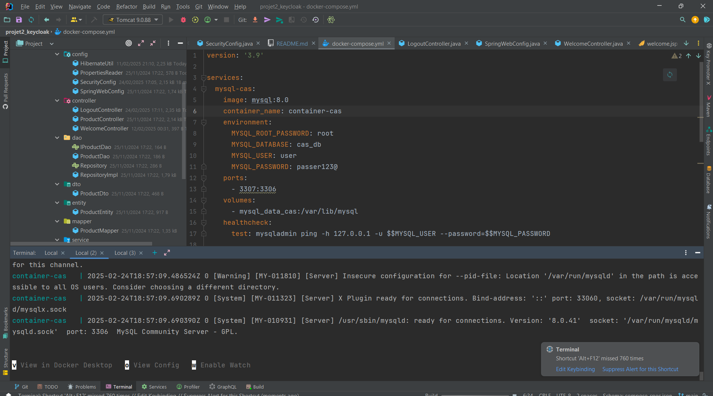
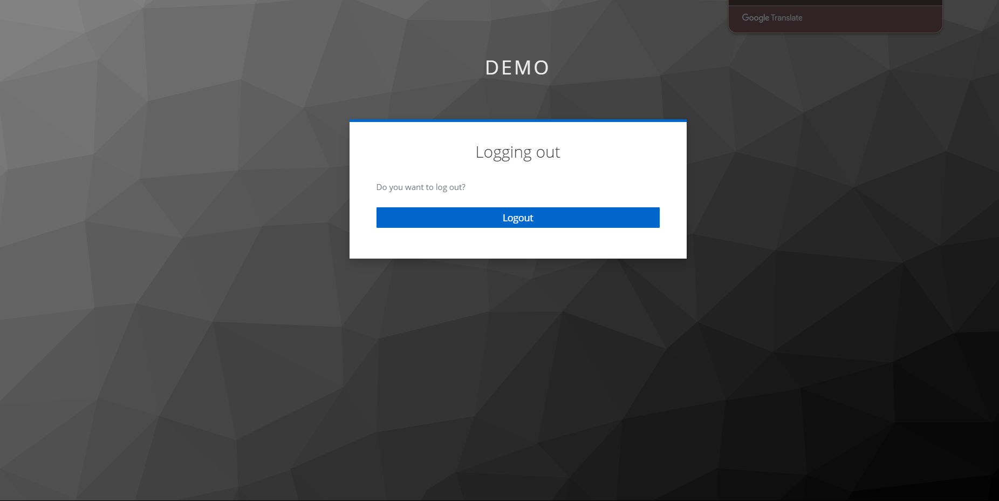

## TODO:
1. Créer une application web maven
2. Ajouter les dépendances spring MVC
3. Gérer l'ajout et la liste dans une base de données avec une classe : Product(ref String, name String)
4. Gérer la sécurité avec keycloak

### Pré-requis
- JDK 11
- Docker
- Tomcat 9
- Maven 3.*

##### Configuration du serveur Tomcat

##### docker compose up pour démarrer la BD

##### Redirection par défaut après démarrage du projet

##### Page de Bienvenue

##### Liste des produits

##### Ajout de produits

##### Liste après ajout

##### Déconnexion

